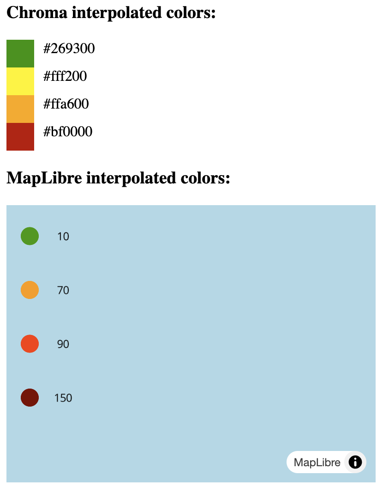

# Different interpolated colors

## The problem

I want to use the colors from MapLibre outside the map in my Web App, but the interpolated colors between Chroma and MapLibre do not match

What needs to be done to get them to match?

[App.tsx: Declare Chroma Scale](https://github.com/itswil/interpolation-colors/blob/main/src/App.tsx#L47)

[App.tsx: Declare Mapbox interpolation](https://github.com/itswil/interpolation-colors/blob/main/src/App.tsx#L99)

